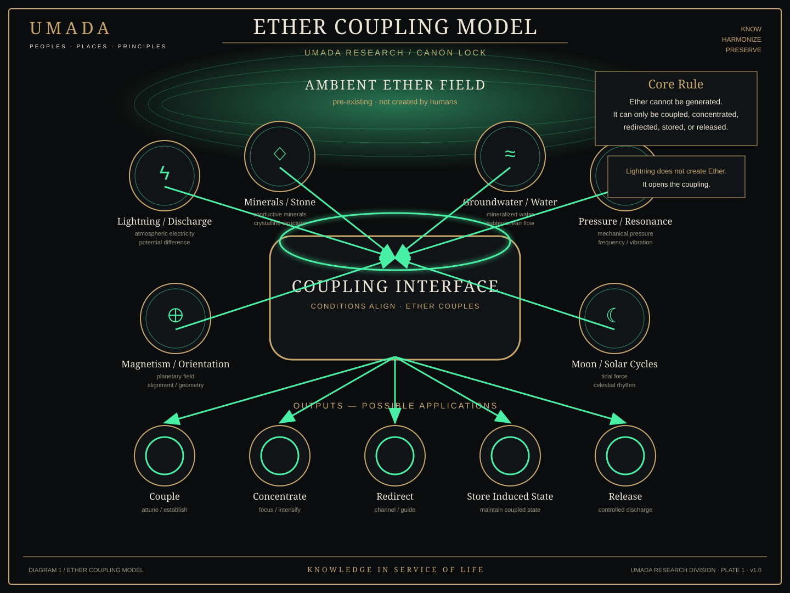
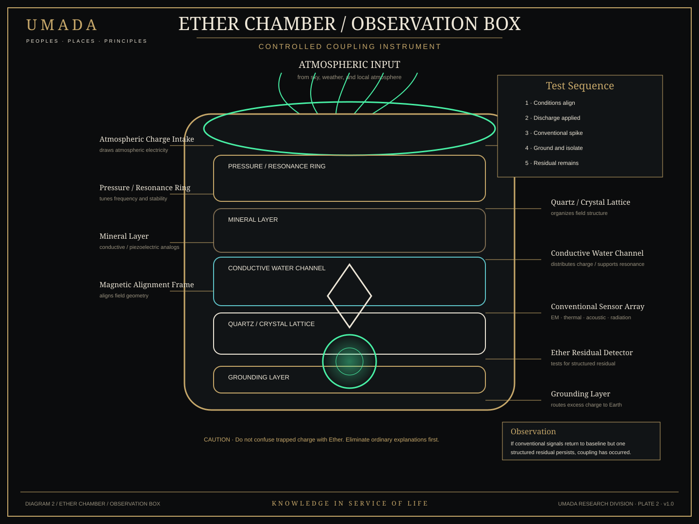
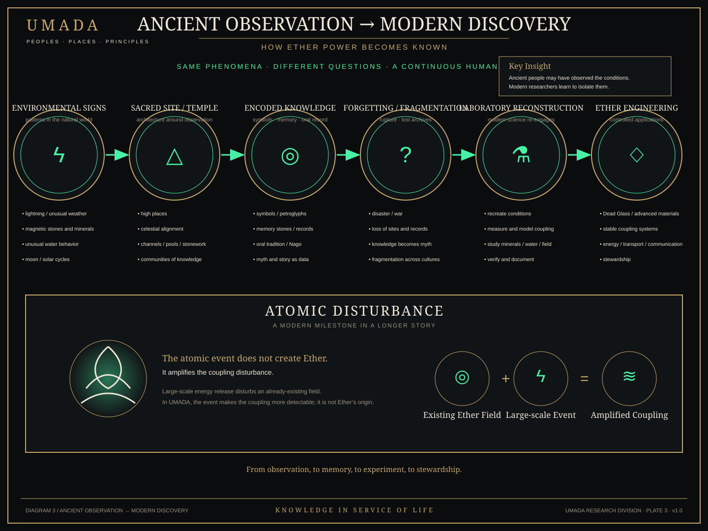

# Ether Research Plates — Series 01

**Status:** Published visual research set  
**Date:** 2026-09-23

These three plates translate the locked UMADA Ether Power coupling model into an accessible visual system. They are SVG-first so text remains crisp, scalable, searchable, and accompanied by embedded `<title>` and `<desc>` accessibility metadata.

## Plate 01 — Ether Coupling Model

**Alt text:** Diagram showing an ambient Ether field that already exists, six environmental coupling conditions—lightning/discharge, minerals/stone, groundwater, pressure/resonance, magnetism/orientation, and moon/solar cycles—feeding a central coupling interface. Five possible outcomes are shown: couple, concentrate, redirect, store an induced state, and release.

## Plate 02 — Ether Chamber / Observation Box

**Alt text:** Cutaway schematic of a fictional UMADA observation chamber with atmospheric input, a controlled discharge point, pressure/resonance ring, mineral layer, conductive water channel, quartz/crystal lattice, magnetic alignment, conventional sensor array, residual detector, and grounding layer. The test sequence requires ordinary electrical, thermal, acoustic, magnetic, and radiation explanations to return to baseline before an anomalous residual is treated as Ether within the fiction.

## Plate 03 — Ancient Observation → Modern Discovery

**Alt text:** Timeline from environmental observation to sacred sites, encoded knowledge, fragmentation, laboratory reconstruction, and later Ether engineering. A separate atomic-disturbance panel states that the atomic event does not create Ether; in UMADA it amplifies a coupling disturbance in a field that already exists.

## Evidence boundary

These plates are **UMADA speculative-fiction research artifacts**, not claims that Ether exists in the real world or that ancient monuments were power plants. Real-world electrical, geological, archaeological, and atmospheric analogues remain documented separately in `14_research/ANCIENT_EARTH_ENERGY_ANALOGUES.md`.
