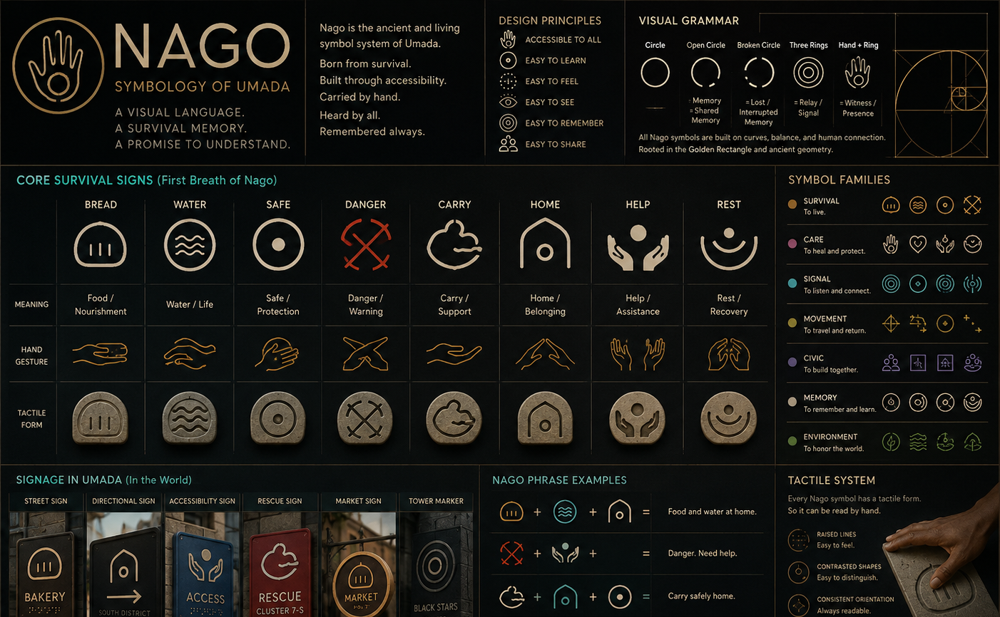

# UMADA

> This is not a world that was built. It is a world being remembered.
> Some records survived. Some did not. Some stories were erased. Some refused to disappear.
> If you stay long enough, you may help us remember.

*Banner is a 1.618∶1 crop of the full reference plate — see
[`PLATE_NAGO_SYMBOLOGY_OF_UMADA.png`](assets/img/PLATE_NAGO_SYMBOLOGY_OF_UMADA.png) for the
complete signage, phrase, and tactile-system detail.*

This repository is the living archive, canon engine, and (eventually) public site for
UMADA — built and maintained under **Aderin / UMADA Steward** mode. See `CLAUDE.md` for
the steward's role and operating rules.

This is the contributor/build-process README. For the fan/visitor-facing welcome, see
[`PUBLIC_README.md`](PUBLIC_README.md).

**Quick links:** [Fan welcome](PUBLIC_README.md) · [Steward brief](CLAUDE.md) ·
[Canon status](00_governance/CANON_STATUS.md) · [Governance](00_governance/) ·
[Production bible](docs/README.md) · [Structured data](data/) ·
[Changelog](CHANGELOG.md) · [Next steps](docs/production/NEXT_STEPS.md)

## What this is

- A canon engine: locked, probable, emerging, and open-question world facts, with no
  fabrication and a full audit trail.
- A living archive: source documents, governance rules, and structured data that the
  public site and future episodes are generated from.
- Not yet a finished show. Episode 1 has a first-pass draft script
  (`11_episodes/EPISODE_01_CAPE_WIPEOUT_SCRIPT.md`) generated precisely from recovered
  canon — no invented dialogue, every gap marked inline; the other two planned releases
  remain unwritten.

## Where things live

- `CLAUDE.md` — the steward brief. Read this first.
- `00_governance/` — the rules: no-fabrication, canon status, accessibility baseline,
  visual layer rules, tiny-questions protocol, fragment workflow, no-generic-glyphs rule.
- `01_canon/` — seed canon, foundational strata, the civilizational ledger, founding myths,
  the visual canon registry, and the open-questions register.
- `02_characters/` … `09_accessibility/` — numbered topic directories (characters,
  relationships, species, world/places, timelines, languages, technology, accessibility).
  Most currently hold a short index pointing to the canon files above rather than
  duplicating them, since very little world detail exists yet beyond what's locked.
- `07_languages/` — the Nago language and signage system documents.
- `10_visuals/`, `11_episodes/`, `12_seasons/`, `13_fragments/`, `14_research/`,
  `15_archive_recovery/`, `16_fanbase/`, `18_fan_archive/`, `19_founding_myths/`,
  `20_visual_canon_registry/` — production, fragment-intake, fanbase, and recovery-log
  directories, populated as the build proceeds and as fragments arrive.
- `data/` — structured JSON the site and tooling read from (canon, timeline, characters,
  factions, visual artifacts, Nago signs and symbology, rescue doctrine, civilizational
  ledger, sources, open questions).
- `schemas/` — JSON Schema (2020-12) definitions for every file in `data/`, validating
  shape only, never canon content. See `schemas/README.md`.
- `assets/img/`, `assets/video/` — the realized Nago plates and the Friedmandostorp
  rescue animatic: the **visual source of truth**. Where any document disagrees with a
  plate, the plate wins.
- `prompts/` — image-generation prompt notes for future concept art and storyboards,
  restating only already-locked visual canon (see `prompts/README.md`); subjects with no
  locked visual reference get a stub, not an invented appearance.
- `sections/`, `assets/css/`, `assets/js/`, `index.html` — the public site (Phase B).
- `docs/` — a production-bible layer for people doing production work, added alongside
  the canon engine above. It cross-links into the engine rather than restating facts;
  the engine remains the source of truth. See `docs/README.md` and
  `docs/canon/GOVERNANCE.md`. Includes `docs/project-management/issues/` (Issue-001
  through Issue-050), every issue traceable to a real open question or `AWAITING
  FRAGMENT` artifact already on record.

## Build status

This repository is being built in three phases — see `CLAUDE_CODE_MASTER_PROMPT.md` in
the originating ship package for the full spec:

- **Phase A — Spine** (done): repo skeleton, governance, canon, and structured
  data, seeded from the source package with nothing invented.
- **Phase B — Site** (done): `index.html` and 20 public sections in `sections/`,
  built on a framework-free static shell (`assets/css/main.css`,
  `assets/js/{data-loader,nav,accessibility}.js`) that renders straight from
  `data/*.json` — no build step required to run the site.
- **Phase C — Ingestion** (in progress): archive-recovery logs
  (`15_archive_recovery/README.md`, `20_visual_canon_registry/README.md`) and deeper
  processing of the artifacts already present in `assets/`. First pass complete: full
  on-screen caption transcript recovered from the rescue animatic (see
  `01_canon/VISUAL_CANON_REGISTRY.md`), surfacing a new locked date (March 19, 2226),
  Ada's full credited name and role, and a new open question about the name "Kassey."

## Canonical facts, locked hard

- Settlement spelling: **Friedmandostorp**.
- Geography: southern-African coastal, Southern Cape corridor, near Cape Agulhas —
  **never Arctic**.
- Core survival signs (eight): Bread, Water, Safe, Danger, Carry, Home, Help, Rest.

Full detail: `00_governance/CANON_STATUS.md`.

## Contributing

Fans and collaborators contribute **signal, not automatic canon**, through the Faraday
Box (`16_fanbase/`). See `18_fan_archive/` for how contributions and development history
are preserved.
