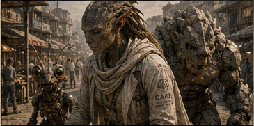

# Claude Implementation Brief — Story Frames + Storyboard as UX Documentation

**Target:** Revise `03_PROTOTYPE/episode-cape-wipeout-pt1-interactive.html` using the frame assets and UX documentation in this package.

---

## 1. Required dual presentation

The revised storyboard must serve two different functions without confusing them.

### A. Story-media layer

Use the clean images in `01_FRAMES/` inside the interactive Episode 1 experience.

Each image should:

- appear with the corresponding route, witness, evidence, or fixed canon beat;
- be presented as responsive media, not as a poster crop with baked-in captions;
- use the manifest alt text;
- support optional expanded viewing;
- never become the only carrier of story information;
- never override the written canon record.

### B. UX-documentation layer

Keep the complete board intact as:

- a separate `UX DOCUMENTATION` or `STORYBOARD` view;
- a figure showing the full flow at once;
- a design artifact that maps anchors, branches, hubs, convergence, rescue perspectives, and closure;
- documentation for writers, artists, engineers, accessibility reviewers, and canon editors.

Do not use the full board as a replacement for the story experience. Do not force users to zoom into the board to read the episode.

---

## 2. Asset source of truth

Use:

- `04_DOCS/FRAME_MANIFEST.json` for code integration;
- `04_DOCS/FRAME_MANIFEST.csv` for editorial review;
- `04_DOCS/FRAME_ALT_TEXT.md` for human-readable accessibility review;
- `02_REFERENCES/TALLAI_CANONICAL_VISUAL_REFERENCE.png` for Tallai consistency.

Do not recrop by eye when the provided frame already exists.

The Python tool in `05_TOOLS/slice_storyboard.py` can regenerate all crops from the board.

---

## 3. Story integration pattern

### Fixed anchor frames

Required and historically locked. The user may inspect evidence but cannot bypass or alter the outcome.

- EP01-F01 — Council Era
- EP01-F02 — Dispatch
- EP01-F03 — Activation
- EP01-F09 — Tick Five
- EP01-F10 — BOOM
- EP01-F16 — Close / Part Two tease

### Hub frames

Open route selection.

- EP01-F04 — Friedmandorstrop arrival hub
- EP01-F11 — Rescue signal hub

### Branch frames

Optional investigative routes that alter knowledge, dossier depth, doctrine visibility, and witness-ledger state.

- EP01-F05 — Garden route
- EP01-F06 — Tallai bread route
- EP01-F07 — Ada route
- EP01-F12 — Quartz route
- EP01-F14 — Tallai stabilization route
- EP01-F15 — Ada memory route

### Convergence frames

Required history whose interpretation changes based on prior branches.

- EP01-F08 — Tick Four / premature KIA record
- EP01-F13 — Ada carried to safety

---

## 4. Required story component

Create a reusable semantic component such as:

```html
<figure class="story-frame" data-frame-id="EP01-F06">
  <button class="frame-expand" aria-label="Enlarge image: Tallai going for bread">
    
  </button>
  <figcaption>
    <span class="frame-label">WITNESS ROUTE — TALLAI</span>
    <span>Examine the familiar bread route before the Wipeout.</span>
  </figcaption>
</figure>
```

Requirements:

- `figure` and `figcaption` must be semantic.
- The image may be enlarged with keyboard and pointer input.
- The enlarged dialog must be modal, closable with Escape, and return focus.
- Image text must not be required to understand the scene.
- Caption copy belongs in HTML, not burned into the story crop.
- Use the crop's natural dimensions or correct aspect ratio to prevent layout shift.

---

## 5. Route selection UX

At the Friedmandorstrop hub, show the relevant frame thumbnails as route cards:

- Garden — EP01-F05
- Tallai / bread route — EP01-F06
- Ada — EP01-F07
- Reporter / device anomaly — use EP01-F03 or a later dedicated image when available

Each route card must state:

- route title;
- evidence type;
- witness or location;
- seen / unseen / partial / complete status;
- accessible action label.

Example:

> **FOLLOW TALLAI'S BREAD ROUTE**  
> Witness + civic routine  
> Status: Unseen

The image is supporting evidence, not the entire button label.

---

## 6. Rescue perspective UX

After BOOM, use EP01-F11 as the rescue hub.

Offer:

- Q detects life;
- Tallai orders care and extraction;
- Quartz clears and carries;
- Ada's bodily memory;
- official record;
- Reporter device feed.

Use images as visual anchors:

- Tallai care — EP01-F11 and EP01-F14
- Quartz / teddy bear — EP01-F12
- evacuation — EP01-F13
- Ada memory — EP01-F15

A user may visit multiple rescue routes before the locked convergence.

---

## 7. BODY / RECORD / WITNESS / ENVIRONMENT / DEVICE

Do not place every channel on every frame.

Show only relevant channels:

- EP01-F05: ENVIRONMENT / WITNESS
- EP01-F06: WITNESS / ENVIRONMENT
- EP01-F07: BODY / WITNESS
- EP01-F08: BODY / RECORD / DEVICE
- EP01-F09: WITNESS / ENVIRONMENT / DEVICE
- EP01-F11: BODY / WITNESS / RECORD
- EP01-F12: WITNESS / ENVIRONMENT
- EP01-F14: BODY / WITNESS / DOCTRINE
- EP01-F15: BODY / WITNESS / RECORD

Channel selection changes what the audience learns and what is added to the witness ledger. It does not create alternate history.

---

## 8. Storyboard UX Documentation view

Add a new primary or secondary navigation destination:

> UX DOCUMENTATION

This view should include:

1. Full revised storyboard image.
2. A clear label: `DESIGN DOCUMENT — NOT THE PRIMARY STORY READER`.
3. Legend for:
   - fixed anchor;
   - hub;
   - branch;
   - convergence;
   - rescue hub.
4. Frame grid generated from `FRAME_MANIFEST.json`.
5. Filters by:
   - phase;
   - UX role;
   - location;
   - witness / evidence route when added.
6. Per-frame metadata:
   - frame ID;
   - title;
   - story phase;
   - UX role;
   - interaction purpose;
   - accessibility description;
   - canon status or warning.
7. Link from each documentation frame to the corresponding live story state when implemented.

The included `03_PROTOTYPE/storyboard-ux-documentation.html` demonstrates this documentation model.

---

## 9. Tallai visual lock

Tallai must match the user-approved reference in `02_REFERENCES/TALLAI_CANONICAL_VISUAL_REFERENCE.png`.

Required traits:

- visibly nonhuman chimera care specialist;
- adult, tall, composed, compassionate presence;
- elongated pointed ears;
- scaled or plated cranial anatomy extending into the hairline;
- fine nonhuman skin patterning;
- pale layered care garments, draped scarf, robe, or lab coat;
- calm medical contact with Ada;
- no generic warrior presentation;
- no ordinary human face with costume-only markers;
- consistent anatomy across bread route, rescue, stabilization, and later Estate-of-Memory imagery.

The cropped board images may be used in the current prototype, but future redraws should move closer to the canonical reference.

---

## 10. Board text and canon warnings

The board contains generated labels and captions. Treat them as UX annotation, not automatic canon.

Do not rely on or silently canonize:

- generated signage;
- device display spelling;
- military emblems;
- protocol names;
- exact timestamps unless separately locked;
- rescue destination;
- institutional acronyms;
- captions that conflict with the Canon Ledger.

When uncertain, expose a canon-status note in the UX documentation view, not inside the immersive story scene.

---

## 11. Accessibility requirements

- Every image has concise alt text from the manifest.
- Complex visual analysis belongs in adjacent text or a long-description disclosure.
- Route cards are keyboard operable.
- Focus moves to newly opened content.
- New evidence and contradictions are announced.
- Full-board documentation has a textual frame list.
- Do not require visual inspection of the full board.
- No hover-only controls.
- Expanded images use an accessible modal.
- Preserve high contrast, large text, reduced motion, and progress settings.
- Save visited routes and frames.

---

## 12. Acceptance criteria

- [ ] Sixteen cropped images load from `01_FRAMES/`.
- [ ] Story captions are HTML, not baked into crops.
- [ ] Full storyboard remains available as UX documentation.
- [ ] UX documentation is not confused with the primary story experience.
- [ ] Route cards use frame images without becoming image-only controls.
- [ ] Fixed anchors, hubs, branches, and convergence points are programmatically identified.
- [ ] The witness ledger records visited frames and evidence channels.
- [ ] Tallai's public visual treatment follows the canonical reference.
- [ ] All images have reviewed alt text.
- [ ] Board-generated text is treated as draft annotation unless canon-locked.
- [ ] Keyboard, screen-reader, zoom, and reduced-motion use remain supported.

---

## Final directive

Use the storyboard twice:

1. **Disassemble it into clean, accessible visual evidence for the interactive episode.**
2. **Preserve it whole as UX documentation showing how the episode's choices, branches, evidence, and fixed history work together.**

Do not collapse those two uses into one screen.
